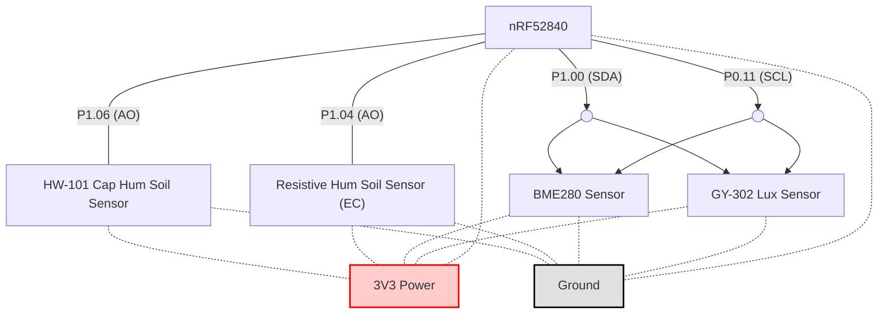

# nRF52840 Sensor Connection Diagram

This document outlines the wiring and pin assignments for connecting various environmental sensors to the nRF52840 development board. The goal is to monitor soil moisture (capacitive and resistive), air temperature/humidity/pressure, and ambient light.

## Pin Assignments

- **P1.06** → Analog Output of HW-101 Capacitive Soil Moisture Sensor
- **P1.04** → Analog Output of Resistive Soil Moisture (EC) Sensor
- **P1.00 (SDA)** → I2C Data Line shared between BME280 and GY-302
- **P0.11 (SCL)** → I2C Clock Line shared between BME280 and GY-302

## Power Connections

All components (sensors and the nRF52840 board) are powered via the **3.3V (3V3)** power rail and share a common **GND** (ground) line.

## Components Overview

- **HW-101 Capacitive Soil Moisture Sensor**: Measures soil moisture without direct exposure of the electrodes to soil, providing better durability and less corrosion.
- **Resistive Humidity (EC) Soil Sensor**: Provides analog output proportional to soil conductivity (moisture level), but is prone to corrosion over time.
- **BME280**: A digital sensor that measures temperature, humidity, and barometric pressure over I2C.
- **GY-302**: A digital light sensor (BH1750) using I2C for ambient light measurements.

---

## Wiring Diagram

Below is a visual representation of the connections:

